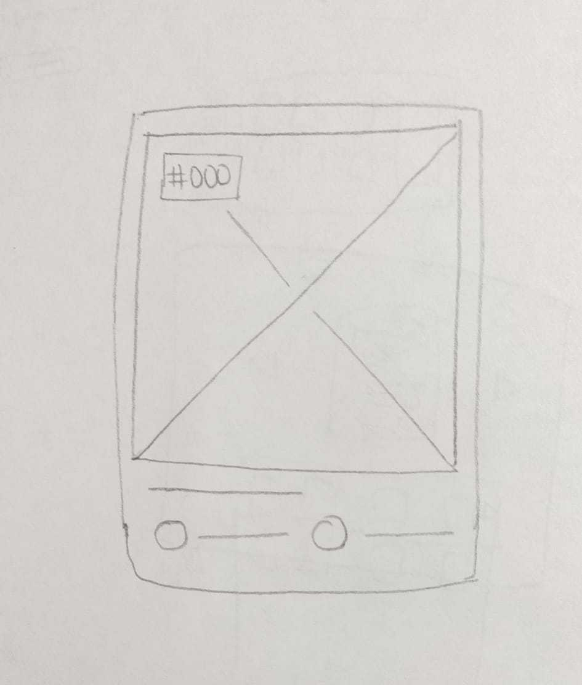
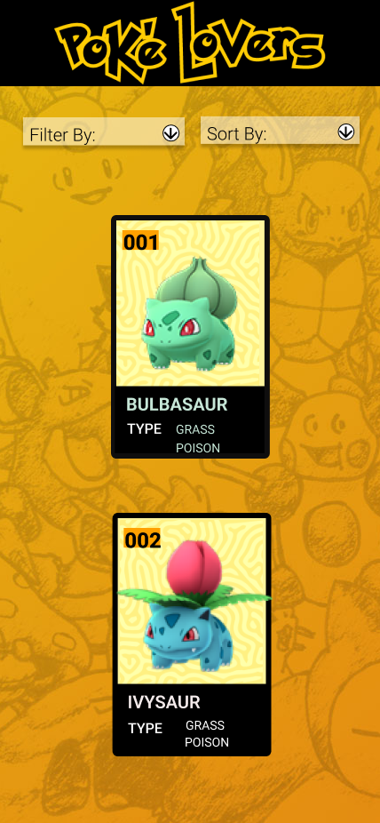

# Data Lovers

## Índice

* [1. Definición del producto](#2-Definición-del-producto)
* [2. Resumen del proyecto](#2-resumen-del-proyecto)
* [3. Objetivo Principal](#3-objetivo-principal)
* [4. Consideraciones generales](#4-consideraciones-generales)
* [5. Criterios de aceptación mínimos del proyecto](#5-criterios-de-aceptación-mínimos-del-proyecto)
* [6. Consideraciones técnicas](#7-consideraciones-técnicas)

***

## 1. Definición del producto

Data Lovers es una _página web_ que permite visualizar e interactuar 
con un set de datos y está enfocada en las necesidades del usuario 
que quiera conocer acerca de los Pokemones de Pokemon Go y sus caracteristicas. 

Es una página fácil de usar, intuitiva y entendible para el usuario.

## 2. Resumen del proyecto

PokeLovers muestra la data en forma de tarjetas y permite que el usuario
filtre por tipo de Pokemon y ordene por número y nombre en orden ascendente y descendente. 
Además muestra dentro del contenido de la tarjeta la sumatoria y promedio de sus estadisticas base:
Ataque, Defensa y Estamina. 

## 3. Objetivo principal

El objetivo principal de este proyecto es aprender a diseñar y construir una
interfaz web donde se pueda visualizar y manipular data, entendiendo lo que el
usuario necesita.

## 4. Consideraciones generales

* Este proyecto se resolvió en dupla:
  
  Desarrolladoras: 
    - Ana Margarita García
    - Angélica Losada

## 5. Criterios de aceptación mínimos del proyecto

### Historias de usuario

Una vez entendidas las necesidades de nuestros usuarios, se describen las Historias
de Usuario en nuestro tablero de [Trello](https://trello.com/b/okSEXWkl/dl15anamargaritaangelica),
representando todo lo que el usuario quiere hacer y ver, 
como resultado de una breve investigación. 

Cada una de las Historias de Usuario especifican la Definición de terminado (_definition of done_)
y los Criterios de Aceptación.

### Prototipo de baja fidelidad

### Prototipo de alta fidelidad

### Implementación de la Interfaz de Usuario (HTML/CSS/JS)

1. Se muestra la data en una interfaz replicando una tarjeta.

2. Permite al usuario interactuar para obtener la infomación que necesita 
  filtrando por tipo de Pokemon y ordenando por número y nombre de manera 
  ascendente y descendente.

3. Es _responsive_.

4. La interfaz sige los fundamentos de _visual design_.

### Pruebas unitarias

Incluye Pruebas Unitarias (_tests_) para las funciones encargadas de  _procesar_,
_filtrar_, _ordenar_ la data, y adicionar informacion como la sumatoria y el promedio 
de las estadisticas base de cada Pokemon a cada una de sus tarjetas.

Las _pruebas unitarias_ dan una cobertura del 100% de _statements_,
 _functions_, _lines_, y _branches_del archivo `src/data.js` que contiene las funciones.

## 6. Consideraciones técnicas

La lógica del proyecto esta implementada completamente en JavaScript
(ES6), HTML y CSS. No contiene frameworks, solo vanilla JavaScript.

#### Herramientas

* [Git](https://git-scm.com/)
* [GitHub](https://github.com/)
* [GitHub Pages](https://pages.github.com/)
* [Trello](https://trello.com/b/okSEXWkl/dl15anamargaritaangelica)
* [Node.js](https://nodejs.org/)
* [Jest](https://jestjs.io/)
* [Figma](https://www.figma.com/file/AVdGQNbe8uSiH8Gk264QeR/POKELOVER?node-id=3%3A6)
* [Visual Studio Code](https://code.visualstudio.com/)